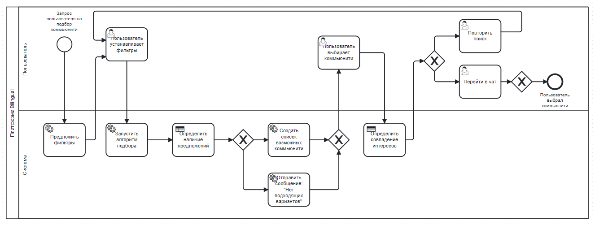

# Моделирование процессов в BPMN

## Описание:

Диаграммы dmn были реализованы в качестве бизнес правил. Они представляют собой развилку действий, побуждение к определенному следующему действию. 
Обе dmn можно развернуть, используя исключающий шлюз, но в диаграмме приведен стандартный краткий вид использования dmn, где далее возможно только 2 действия. 

Использование dmn диаграмм позволит системе принимать решение на основе входных и выходных параметров, реализуя алгоритм отбора.

- **DMN 1** проверяет наличие предложений на основе фильтров (язык, уровень владения языком и тд.).

- **DMN 2** проверяет, совпадают ли интересы пользователя и выбранного коммьюнити.

