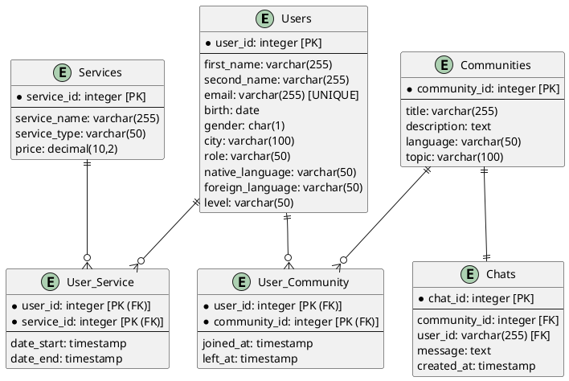

# Модель данных

## Логическая модель

import Drawio from '@theme/Drawio'
import diagram from '!!raw-loader!./model.drawio';

<Drawio content={diagram} editable={false} />

---
## Физическая модель


---
## Users

| Название         | Тип        | Описание                          |
| --------         | ---------- | --------------------------------- |
| user_id          | int        | Идентификатор пользователя        |
| first_name       | varchar    | Имя пользователя                  |
| last_name        | varchar    | Фамилия пользователя              |
| email            | varchar    | Электронная почта                 |
| birth            | date       | Дата рождения пользователя        |
| gender           | char       | Пол пользователя (Ж, М)           |
| city             | varchar    | Выбранный город                   |
| role             | varchar    | Роль (Студент, партнер)           | 
| native_language  | varchar    | Родной язык                       |
| foreign_language | varchar    | Изучаемый язык                    |
| level            | varchar    | Уровень владения изучаемым языком |

## Communities

| Название      | Тип     | Описание                 |
| --------      | ------- | ------------------------ |
| community_id  | int     | Идентификатор сообщества |
| title         | varchar | Название сообщества      |
| description   | varchar | Описание                 |
| language      | varchar | Язык сообщества          |
| topic         | varchar | Ключевая тема            |

## User_Community

| Название      | Тип       | Описание                   |
| --------      | ----------| ---------------------------|
| user_id       | int       | Идентификатор пользователя |
| community_id  | int       | Идентификатор сообщества   |
| joined_at     | timestamp | Дата присоединения         |
| left_at       | timestamp | Дата выхода                |

## Chats

| Название      | Тип       | Описание                   |
| --------      | ----------| ---------------------------|
| chat_id       | int       | Идентификатор чата         |
| community_id  | int       | Идентификатор сообщества   |
| user_id       | int       | Идентификатор пользователя |
| message       | text      | Текст сообщения            |
| created_at    | timestamp | Дата создания сообщения    |

## Services

| Название      | Тип     | Описание                      |
| --------      | ------- | ----------------------------- |
| service_id    | int     | Идентификатор услуги          |
| service_name  | varchar | Название услуги               |
| service_type  | varchar | Тип услуги (Подписка, услуга) |
| price         | decimal | Стоимость                     |

## User_Service

| Название      | Тип       | Описание                      |
| --------      | --------- | ----------------------------- |
| user_id       | int       | Идентификатор пользователя    |
| service_id    | int       | Идентификатор услуги          |
| date_start    | timestamp | Дата начала действия          |
| date_end      | timestamp | Дата окончания действия       |

## Создание БД

```

CREATE TABLE IF NOT EXISTS Users (
	user_id integer NOT NULL unique,
	first_name varchar(255) NOT NULL,
	last_name varchar(255) NOT NULL,
	email varchar(255) NOT NULL UNIQUE,
	birth date NOT NULL,
	gender varchar(1) NOT NULL,
	city varchar(100) NOT NULL,
	role varchar(50) NOT NULL,
	native_language varchar(50) default 'Russian',
	foreign_language varchar(50) default 'English',
	level varchar(50) NOT NULL,
	PRIMARY KEY (user_id)
);

CREATE TABLE IF NOT EXISTS Communities (
	community_id integer NOT NULL unique,
	title varchar(100) NOT NULL,
	description varchar(255) NOT NULL,
	language varchar(50) NOT NULL,
	topic varchar(50) NOT NULL,
	PRIMARY KEY (community_id)
);

CREATE TABLE IF NOT EXISTS Services (
	service_id integer NOT NULL unique,
	service_name varchar(255) NOT NULL,
	service_type varchar(50) NOT NULL,
	price numeric(10,2) NOT NULL,
	PRIMARY KEY (service_id)
);

CREATE TABLE IF NOT EXISTS User_Service (
	user_id integer NOT NULL,
	service_id integer NOT NULL,
	date_start timestamp with time zone NOT NULL,
	date_end timestamp with time zone NOT NULL,
	PRIMARY KEY (user_id, service_id)
);

CREATE TABLE IF NOT EXISTS User_Community (
	user_id integer NOT NULL,
	community_id integer NOT NULL,
	joined_at timestamp with time zone NOT null,
	left_at timestamp with time zone,
	PRIMARY KEY (user_id, community_id)
);

CREATE TABLE IF NOT EXISTS Chats (
	chat_id integer NOT NULL,
	user_id integer NOT NULL,
	message varchar(255) NOT NULL,
	created_at timestamp with time zone NOT NULL,
	PRIMARY KEY (chat_id)
);


ALTER TABLE User_Service ADD FOREIGN KEY (user_id) REFERENCES Users(user_id);

ALTER TABLE User_Service ADD FOREIGN KEY (service_id) REFERENCES Services(service_id);

ALTER TABLE User_Community ADD FOREIGN KEY (user_id) REFERENCES Users(user_id);

ALTER TABLE User_Community ADD FOREIGN KEY (community_id) REFERENCES Communities(community_id);

ALTER TABLE Chats ADD FOREIGN KEY (chat_id) REFERENCES Communities(community_id);

ALTER TABLE Chats ADD FOREIGN KEY (user_id) REFERENCES Users(user_id);

--drop table Chats ;
--drop table Communities ;
--drop table Services ;
--drop table User_Community ;
--drop table User_Service ;
--drop table Users ;

```

## Наполнение БД тестовыми данными

```
INSERT INTO users 
VALUES
(1, 'Brenna', 'Cochran', 'ligula.nullam@icloud.edu', '2007-09-15', 'F', 'Galway', 'Student', 'Russian', 'English', 'Beginner'),
(2, 'Gillian', 'Vinson', 'est.ac.facilisis@google.ca', '1988-10-15', 'M', 'Yogyakarta', 'Partner', 'Russian', 'English', 'Advanced'),
(3, 'Paul', 'Paul', 'euismod.et@yahoo.net', '1991-12-25', 'M', 'Galway', 'Student', 'Russian', 'English', 'Intermediate'),
(4, 'Philip', 'Brady', 'mi@yahoo.couk', '1996-05-27', 'M', 'Devonport', 'Student', 'Russian', 'English', 'Beginner'),
(5, 'Axel', 'Simmons', 'natoque.penatibus@outlook.com', '1988-10-15', 'M', 'Murray Bridge', 'Partner', 'Russian', 'English', 'Advanced'),
(6, 'Aidan', 'Shepard', 'lobortis.risus@yahoo.ca', '1990-02-18', 'M', 'Galway', 'Student', 'Russian', 'English', 'Intermediate'),
(7, 'Brendan', 'Bush', 'lacus.pede.sagittis@google.org', '2005-05-26', 'F', 'Mirpur', 'Student', 'Russian', 'English', 'Beginner'),
(8, 'Dai', 'Jarvis', 'ligula.tortor@yahoo.edu', '2017-04-16', 'M', 'Yogyakarta', 'Partner', 'Russian', 'English', 'Advanced'),
(9, 'Castor', 'Gay', 'velit.dui@google.ca', '2013-07-21', 'M', 'Galway', 'Student', 'Russian', 'English', 'Intermediate'),
(10, 'Talon', 'Talon', 'augue.scelerisque.mollis@aol.net', '1986-11-28', 'F', 'Judenburg', 'Student', 'Russian', 'English', 'Beginner');

insert into communities 
values
(1, 'First', 'We talk about traveling', 'English', 'Travel'),
(2, 'Second', 'We talk about sport', 'English', 'Sport'),
(3, 'Third', 'We talk about jobs', 'English', 'Job'),
(4, 'Fourth', 'We talk about studying', 'English', 'Study'),
(5, 'Fifth', 'We talk about internships', 'English', 'Internship'),
(6, 'Sixth', 'We talk about beauty things', 'English', 'Beauty'),
(7, 'Seventh', 'We talk about music', 'English', 'Music'),
(8, 'Eighth', 'We talk about SA', 'English', 'SA'),
(9, 'Ninth', 'We talk about technology', 'English', 'Technology'),
(10, 'Tenth', 'We talk about food', 'English', 'Food');

insert into services 
values
(1, 'Basic', 'Subscription', 0),
(2, 'Premium', 'Subscription', 399),
(3, 'Grammar', 'Service', 600),
(4, 'Vocabulary', 'Service', 650),
(5, 'Speaking', 'Service', 999),
(6, 'Listening', 'Service', 800),
(7, 'Reading', 'Service', 750),
(8, 'Writing', 'Service', 400),
(9, 'Business English', 'Service', 1500),
(10, 'Technical English', 'Service', 1500);

insert into chats 
values
(1, 1, 1, 'Hello', '2024-11-30 10:23:54+02'),
(2, 1, 2, 'I want to', '2024-11-30 11:23:54+02'),
(3, 3, 2, 'introduce', '2024-11-30 12:23:54+02'),
(4, 3, 6, 'my new app', '2024-11-30 13:23:54+02'),
(5, 3, 5, 'Bilingual', '2024-11-30 14:23:54+02'),
(6, 1, 8, 'This is', '2024-11-30 15:23:54+02'),
(7, 4, 3, 'The best', '2024-11-30 16:23:54+02'),
(8, 3, 2, 'App for', '2024-11-30 17:23:54+02'),
(9, 5, 4, 'you to', '2024-11-30 18:23:54+02'),
(10, 5, 7, 'find friends and learn language', '2024-11-30 19:23:54+02');

insert into user_community 
values
(1, 1, '2024-11-30 10:23:54+02', NULL),
(1, 2, '2024-11-30 11:23:54+02', NULL),
(2, 3, '2024-11-30 11:23:54+02', NULL),
(3, 4, '2024-11-30 12:23:54+02', NULL),
(4, 5, '2024-11-30 13:23:54+02', NULL),
(5, 3, '2024-11-30 14:23:54+02', NULL),
(6, 3, '2024-11-30 12:23:54+02', NULL),
(7, 4, '2024-11-30 11:23:54+02', NULL),
(7, 5, '2024-11-30 17:23:54+02', NULL),
(8, 1, '2024-11-30 18:23:54+02', NULL);

insert into user_service 
values
(1, 1,'2024-11-29 15:23:54+02', '2099-01-01 01:01:01+02'),
(2, 1,'2024-11-30 15:23:54+02', '2099-01-01 01:01:01+02'),
(3, 1,'2024-11-30 17:23:54+02', '2099-01-01 01:01:01+02'),
(4, 2,'2024-11-30 16:23:54+02', '2024-12-30 16:23:54+02'),
(5, 3,'2024-11-30 16:15:54+02', '2024-12-30 16:15:54+02'),
(6, 4,'2024-11-30 16:45:54+02', '2024-12-30 16:45:54+02'),
(7, 5,'2024-11-30 17:23:54+02', '2024-12-30 17:23:54+02'),
(8, 9,'2024-11-30 17:34:54+02', '2024-12-30 17:34:54+02'),
(9, 6,'2024-11-30 17:34:54+02', '2024-12-30 17:34:54+02'),
(10, 7,'2024-11-30 18:25:54+02', '2024-12-30 18:25:54+02');

```