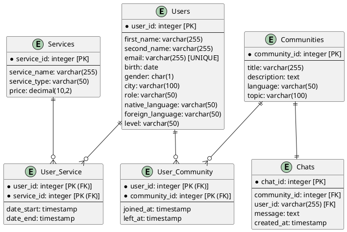

# Модель данных

## Логическая модель

import Drawio from '@theme/Drawio'
import diagram from '!!raw-loader!./model.drawio';

<Drawio content={diagram} editable={false} />

---
## Физическая модель

---
## Users

| Название         | Тип        | Описание                          |
| --------         | ---------- | --------------------------------- |
| user_id          | int        | Идентификатор пользователя        |
| first_name       | varchar    | Имя пользователя                  |
| last_name        | varchar    | Фамилия пользователя              |
| email            | varchar    | Электронная почта                 |
| birth            | date       | Дата рождения пользователя        |
| gender           | char       | Пол пользователя (Ж, М)           |
| city             | varchar    | Выбранный город                   |
| role             | varchar    | Роль (Студент, партнер)           | 
| native_language  | varchar    | Родной язык                       |
| foreign_language | varchar    | Изучаемый язык                    |
| level            | varchar    | Уровень владения изучаемым языком |

## Communities

| Название      | Тип     | Описание                 |
| --------      | ------- | ------------------------ |
| community_id  | int     | Идентификатор сообщества |
| title         | varchar | Название сообщества      |
| description   | varchar | Описание                 |
| language      | varchar | Язык сообщества          |
| topic         | varchar | Ключевая тема            |

## User_Community

| Название      | Тип       | Описание                   |
| --------      | ----------| ---------------------------|
| user_id       | int       | Идентификатор пользователя |
| community_id  | int       | Идентификатор сообщества   |
| joined_at     | timestamp | Дата присоединения         |
| left_at       | timestamp | Дата выхода                |

## Chats

| Название      | Тип       | Описание                   |
| --------      | ----------| ---------------------------|
| chat_id       | int       | Идентификатор чата         |
| community_id  | int       | Идентификатор сообщества   |
| user_id       | int       | Идентификатор пользователя |
| message       | text      | Текст сообщения            |
| created_at    | timestamp | Дата создания сообщения    |

## Services

| Название      | Тип     | Описание                      |
| --------      | ------- | ----------------------------- |
| service_id    | int     | Идентификатор услуги          |
| service_name  | varchar | Название услуги               |
| service_type  | varchar | Тип услуги (Подписка, услуга) |
| price         | decimal | Стоимость                     |

## User_Service

| Название      | Тип       | Описание                      |
| --------      | --------- | ----------------------------- |
| user_id       | int       | Идентификатор пользователя    |
| service_id    | int       | Идентификатор услуги          |
| date_start    | timestamp | Дата начала действия          |
| date_end      | timestamp | Дата окончания действия       |

