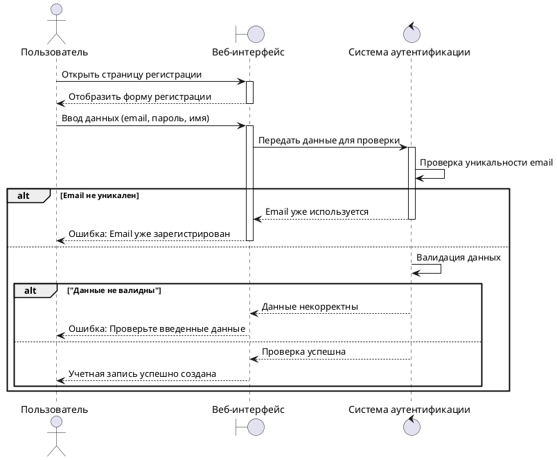
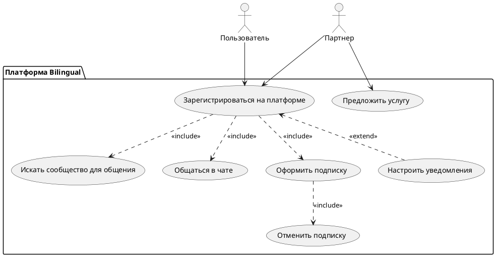

# UML диаграммы

## Sequence diagram "Регистрация пользователя"

В данном сценарии задействованы **3 объекта:**

- **Пользователь** (User) — актор, который инициирует процесс регистрации.

- **Веб-интерфейс** (UI) — пользовательский интерфейс, который взаимодействует с пользователем.

- **Система аутентификации** (AuthSystem) — система, которая проверяет данные и регистрирует пользователя в базе.

**Шаги диаграммы:**

1. Пользователь открывает платформу и инициализирует процесс регистрации.

2. Вводит необходимые данные (email, пароль, имя и т.д.).

3. Веб-интерфейс передает данные в систему аутентификации.

4. Система аутентификации проверяет данные на корректность (например, уникальность email).

5. Если данные корректны, система создает учетную запись и отправляет подтверждение пользователю.

**В диаграмме реализованы временные линии жизни системы, которые отображают синхронные и асинхронные процессы.** 

**UI** активируется при взаимодействии с пользователем и дезактивируется после завершения процесса.

**AuthSystem** активируется на этапе проверки данных и отключается после завершения проверки.

Система аутентификации выполняет валидацию и проверку email синхронно (включение и отключение).

Сообщения об ошибках передаются обратно в пользовательский интерфейс и отображаются пользователю асинхронно.

**Реализовано два альтернативных сценария:**
  
1. Email не уникален. Сценарий не позволяет пользователю пройти регистрацию, если email уже зарегистрирован и возвращает соответствующий ответ.

2. Данные не валидны. Система проверяет корректность введенных данных и в случае не удовлетворения условий, возвращает соответствующий ответ.

## Use case diagram 

#### Содержание схемы:

На диаграмме показаны сценарии использования MVP. Показаны 2 актора: Пользователь и Партнер платформы и их взаимодействие между собой на платформе.

- **Акторы:**

  - **Пользователь**: основное лицо, взаимодействующее с системой. Пользователь имеет роль, позволяющую ему регистрироваться, искать сообщества, общаться и оформлять подписки.

  - **Партнер**: лицо или организация, предлагающая языковые услуги через платформу.

- **Варианты использования:**

  - **Зарегистрироваться на платформе (UC1):** позволяет пользователям и партнерам создать аккаунт на платформе.

  - **Предложить услугу (UC7):** партнеры могут предлагать свои услуги на платформе.

**Ассоциация:**

Стрелки между акторами и вариантами использования показывают действия, которые актор может совершать на платформе. Пользователь связан с действием "Зарегистрироваться на платформе" (UC1), Партнер связан с "Зарегистрироваться на платформе" (UC1) и Предложить услугу (UC7).
